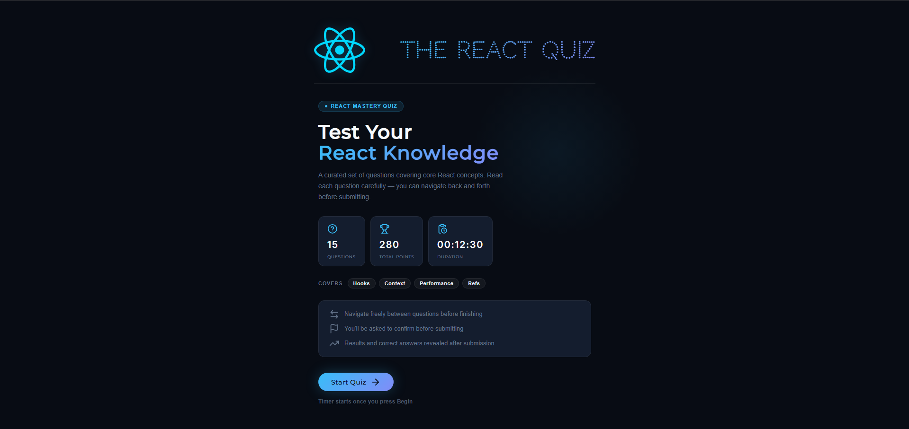
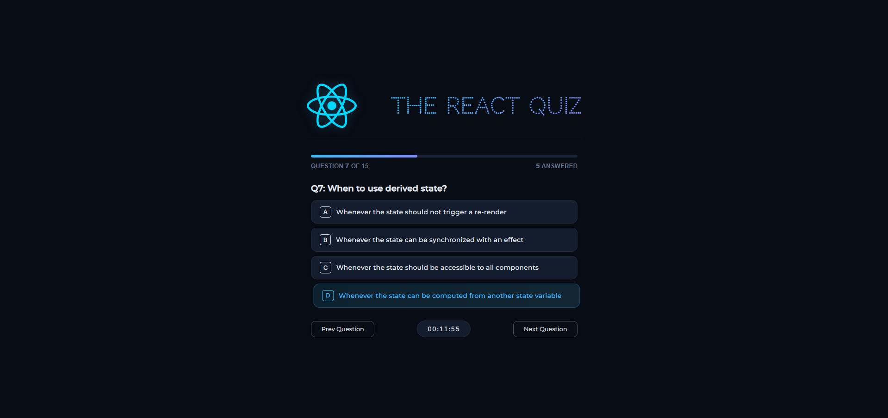
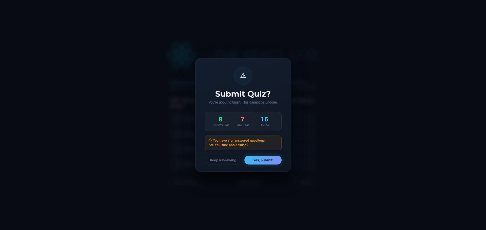
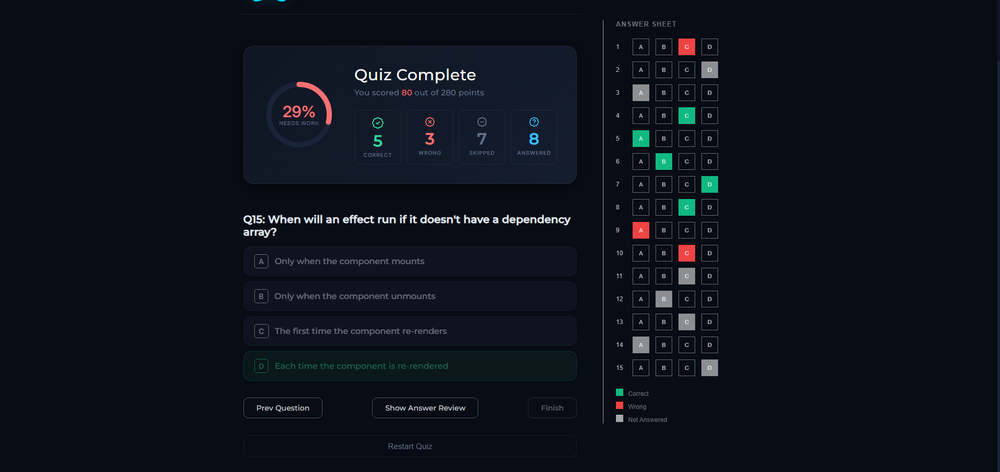

#  Quiz Platform

> A modern, scalable Quiz & Assessment Platform built with React 19 + TypeScript.

This project started as a quiz engine and is being developed into a full-featured online exam platform.

---

## 🔴 Live Demo

👉 https://your-vercel-link.vercel.app  
*(Deploy via Vercel for best performance)*

---

## 📸 Preview

### Start Screen
Clean overview of quiz details before starting.



---

### Quiz Interface
Live quiz session with timer and navigation and confirmation at the end




---

### Result Analytics
Detailed result breakdown with score visualization.



---

## ✨ Current Features

- ⚛ Built with React 19
- 🟦 Fully typed with TypeScript
- ⚡ Fast build system using Vite
- 🧠 State management using useReducer
- ⏱ Timer-based quiz system
- 📊 Dynamic progress tracking
- 🧾 Professional Answer Sheet sidebar
- 🎯 Smart evaluation after completion
- 📈 Result analytics view
- 🎨 Modern sharp-edge UI design
- 📱 Responsive layout

---

## 📦 Installation
Clone the repository:
```bash
git clone https://github.com/HosseinMst81/quiz-platform.git
cd quiz-platform
npm install
```
Start development server:
```bash
npm run dev
```
Start mock API server:
```bash
npm run fake_api
```

## 🏗 Architecture

State is managed using a centralized reducer pattern for scalability.

```ts
type State = {
  questions: Question[];
  status: "loading" | "error" | "ready" | "active" | "finished";
  index: number;
  answers: (number | undefined)[];
  remainingTime: number;
};
```

| Technology   | Purpose      |
| ------------ | ------------ |
| React 19     | UI Library   |
| TypeScript   | Type Safety  |
| Vite         | Build Tool   |
| JSON Server  | Mock Backend |
| Lucide React | Icons        |
| ESLint       | Code Quality |

## 📌 Status

### 🟠 Actively in development
This repository will continue evolving toward a production-ready exam platform.

